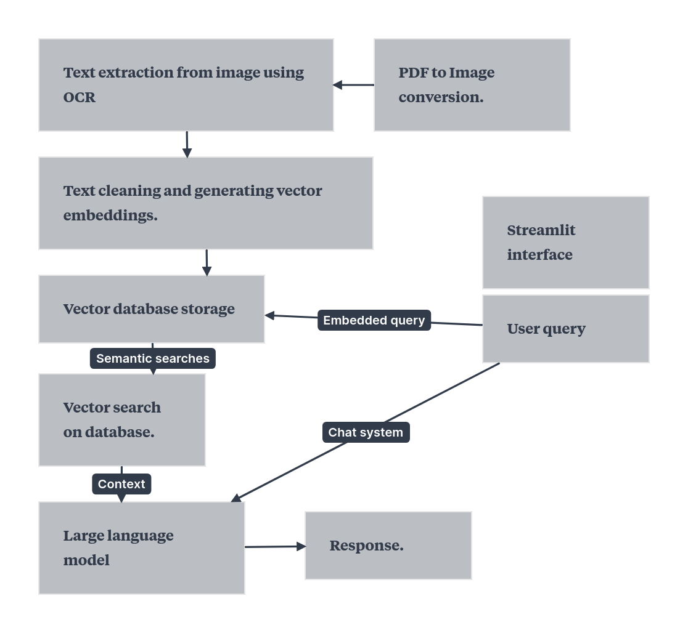

# Architecture

## Dataset
The dataset given was in .pdf format. It contained 1,088 entries, each having an average of 5 pages per case. These cases have details like:

* High Court Judge who is ruling
* The plaintiff/plaintiffs
* The defendant/defendants
* The police station that filed the case
* The evidence submitted to the court
* The final Verdict given by the court.

## Image Conversion
As direct text extraction isn't possible, first its necessary to transform each page of the image into individual images that can be converted to text using OCR models.
These models help convert Images that contain text into a text format for extracting information.

## Text Embedding
The main idea we propose is the use of a vector database as opposed to a standard SQL database as it allows us to store text data by taking its work embedding.
This allows for a storage of 'similar' documents nearby. This means that the documents that are nearer each other are by nature similar in properties.

## Text retrieval
The user's query is converted to vector embeddings and then a similarity metric(eg: Cosine similarity) is used to find the vectors(corresponding to each stored document) that are the most similar to the user query. The top "k" most similar docments are returned/retrieved from the vector database.

## ChatBot
The retrieved text(court document) is sent to the large language model as context. The model then generates a response with respect to the user query and the passed textual document.

# Design
## PDF to Image conversion
- **Used PyMuPdf** - a Python binding for the MuPdf library to facilitate lightweight, high performance conversion of Pdf files to other supported formats, here for pdf to image conversions.
- **Logic** : Straightforward text extraction from the pdfs not possible due to its inherent image nature. Therefore conversions to image files is necessary.
- *Directories created for each pdf file -> Converted to image file(per pdf page) -> stored under respected file directories(.png).*

## Text extraction from Image files
- **Used PyTesseract** - a Python wrapper for the open-source OCR(Optical Character Recognition) library developed by Google, Tesseract.
- **Logic** : The contents present in the images are to be extracted in a textual format to make the information accessable, retrievable and storable.
- *Directories created for each converted image -> PyTesseract for converting images to strings of text -> Extracted text stored under respective directories(.txt).*

# Scalability

